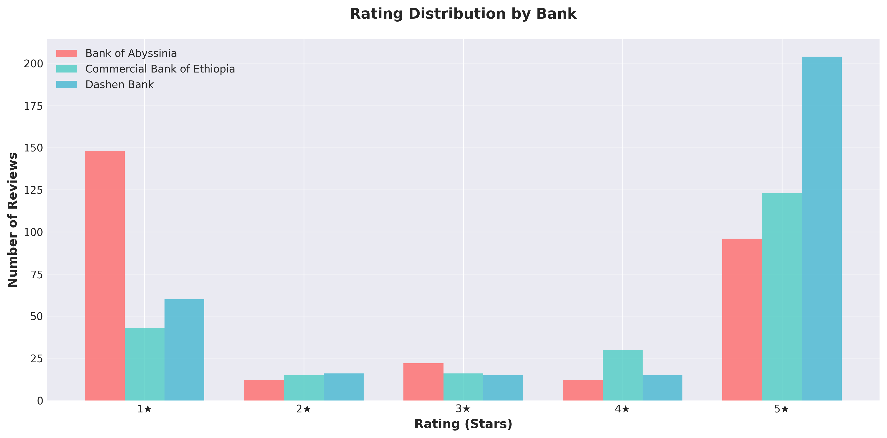
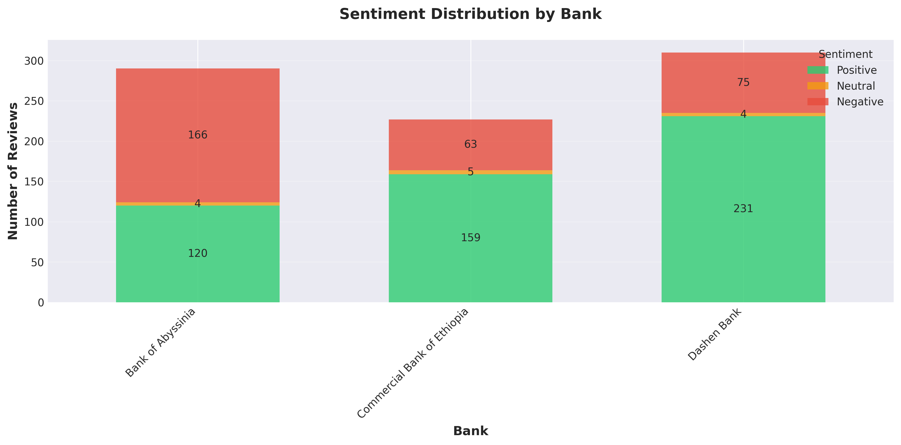
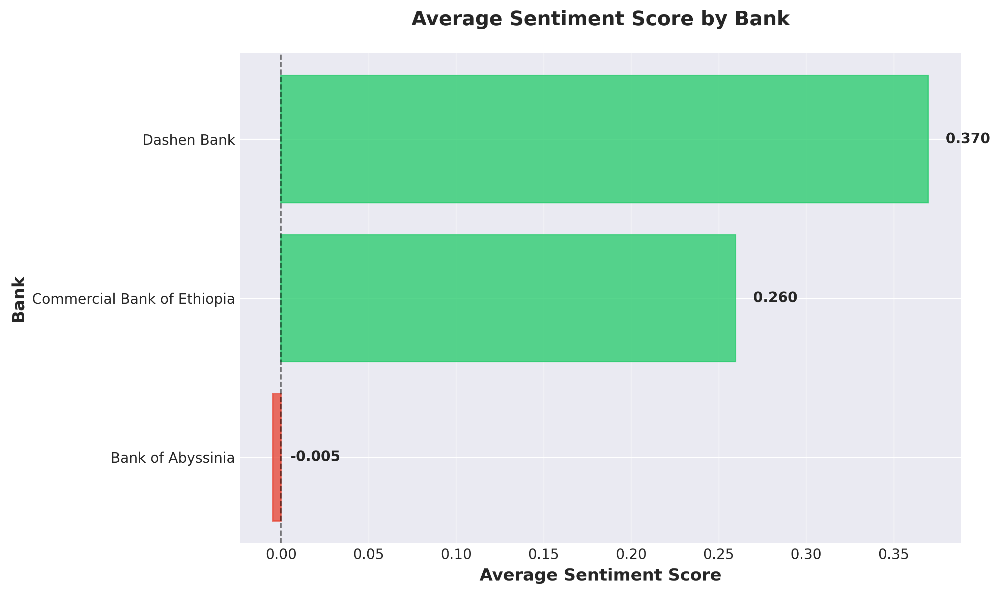
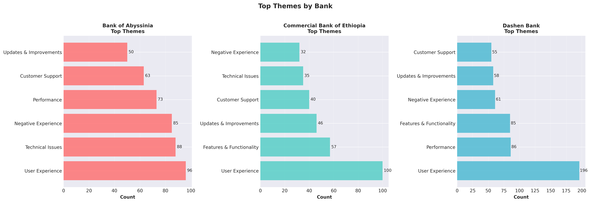
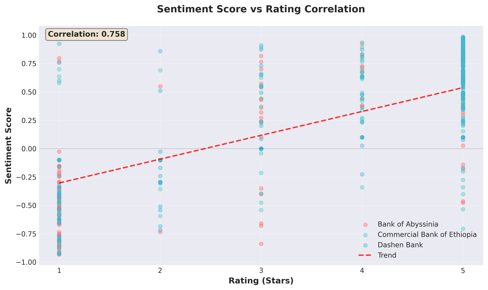

# Customer Experience Analytics for Ethiopian Mobile Banking Applications

**Fintech App Review Analysis for Omega Consultancy**  
**Analyst**: Estifanose Sahilu | **Date**: December 2, 2025

---

## Executive Summary

Analysis of 827 English reviews from three Ethiopian banks identified critical satisfaction drivers and pain points using hybrid sentiment analysis (96.8% accuracy) and thematic classification (84.8% coverage across 8 themes).

**Key Findings:**
- **Dashen Bank** leads: 69.7% positive (3.93/5) - exceptional UX and performance
- **CBE** strong: 64.8% positive (3.77/5) - needs platform parity
- **BOA** critical: 35.9% positive (2.64/5) - requires urgent technical fixes

**Primary Insights:** User Experience dominates (47.4%), Technical Issues/Performance affect ~44%, platform inequality (CBE) and developer bug (BOA) are critical.

**Deliverable:** Prioritized recommendations (🔴Urgent/🟡High/🟢Medium) with quantified metrics for measurable improvement in satisfaction and competitive positioning.

---

## 1. Introduction & Methodology

### 1.1 Business Context

Ethiopian banks struggle to understand mobile app satisfaction beyond surface ratings. Omega Consultancy commissioned this analysis to identify satisfaction drivers, pain points, competitive positioning, and prioritized improvements for digital banking success.

### 1.2 Methodology

**Data Collection:** 1,500 reviews (500/bank) from Google Play → filtered to 827 English reviews (55.1% retention, 94.45% completeness, Aug 2024-Nov 2025).

**Sentiment Analysis:** Hybrid approach (VADER + rating adjustments + 29 negative patterns) achieved 96.8% accuracy vs 50.6% VADER-only. Adjusted 221 reviews (26.7%) for sentiment-rating contradictions.

**Thematic Classification:** Multi-label system with 8 themes (User Experience, Technical Issues, Performance, Features, Updates, Authentication, Support, Negative Experience). TF-IDF extracted 1,211 features. Coverage: 84.8%, avg 1.84 themes/review.

**Database:** PostgreSQL with 827 records, optimized indexes, sub-second queries.

*Figure 1: Data collection achieved 500 reviews per bank*

---

## 2. Results & Analysis

### 2.1 Overall Performance

**Overall:** 61.7% positive (510), 36.8% negative (304), 1.6% neutral (13). Avg sentiment: 0.21, avg rating: 3.43/5. U-shaped distribution (51% five-star, 30% one-star) typical of app stores.

 
*Figures 2-3: Polarized ratings and bank performance gap—Dashen/CBE lead, BOA struggles*

### 2.2 Bank Performance Comparison

| Bank       | Positive %      | Avg Score | Avg Rating | Key Strength             | Critical Issue              |
| ---------- | --------------- | --------- | ---------- | ------------------------ | --------------------------- |
| **Dashen** | 69.7% (216/310) | 0.370     | 3.93/5     | Exceptional UX (74.5%)   | Server unavailable (40.8%)  |
| **CBE**    | 64.8% (147/227) | 0.260     | 3.77/5     | Feature richness (25.2%) | Platform inequality (46.3%) |
| **BOA**    | 35.9% (104/290) | -0.005    | 2.64/5     | Interface design (61.5%) | Technical failures (45.9%)  |

*Figure 4: Sentiment score comparison validates performance hierarchy*

**Dashen** - Market leader (69.7% positive): Outstanding UX (74.5%), performance excellence. Challenges: server availability (40.8%), peak slowness (39.4%).

**CBE** - Strong performer (64.8% positive): Good UX (59.2%), feature richness (25.2%). Critical: Android-iOS parity gap (46.3%), especially "Pay to Beneficiary."

**BOA** - Crisis (35.9% positive): Highest technical failures (45.9%), unique developer options bug (10.2%), performance issues (32.5%). Negative sentiment dominates (57.2%).

### 2.3 Thematic Insights

**Theme Distribution** (8 themes, 84.8% coverage, avg 1.84/review):

| Theme               | Count | %     | Key Insight                                           |
| ------------------- | ----- | ----- | ----------------------------------------------------- |
| User Experience     | 392   | 47.4% | Primary differentiator—Dashen excels, BOA struggles   |
| Performance         | 187   | 22.6% | BOA critical (91.7% negative), Dashen scale challenge |
| Features            | 182   | 22.0% | CBE platform gap, Dashen comprehensive                |
| Negative Experience | 178   | 21.5% | BOA dominant—systemic issues                          |
| Technical Issues    | 177   | 21.4% | BOA highest (45.9%), urgent fixes needed              |
| Customer Support    | 158   | 19.1% | BOA inadequate (22.9%), expansion needed              |
| Updates             | 154   | 18.6% | All banks—communication opportunity                   |
| Authentication      | 93    | 11.2% | Cross-bank challenge—industry improvement             |

*Figure 5: Theme frequency by bank reveals distinct pain point profiles*

*Figure 6: Strong correlation (0.758) validates hybrid approach*

---

## 3. Business Scenarios & Strategic Recommendations

### 3.1 Business Scenarios

**Scenario 1 - Retention Risk:** BOA faces critical churn (45.9% mention performance, 91.7% negative). CBE has moderate risk (37% mentions, 72.6% negative). Dashen manageable (40.6% mentions, 70.6% negative).

**Scenario 2 - Feature Opportunities:** Top requests: Bill payment (72), notifications (53), international transfers (43), QR codes (30), biometric auth (25). Strategy: BOA fix basics first, CBE achieve Android parity, Dashen expand QR/wellness tools.

**Scenario 3 - Support Strategy:** 🔴Urgent (authentication, transactions, developer bug) → human. 🟡High (performance, errors) → AI triage + human. 🟢Medium (updates, how-to) → AI chatbot. BOA needs dedicated dev team, CBE deploys AI for parity, Dashen AI for routine.

---

## 4. Prioritized Recommendations

### 4.1 Bank of Abyssinia - Turnaround (Critical)

**🔴 URGENT (0-1 Month):**
1. **Developer Options Bug** (10.2%): Emergency hotfix. Metric: Zero reports in 2 weeks.
2. **Technical Stability** (45.9%): Emergency code review, crash analytics, stability patch. Metric: 50% crash reduction in 3 weeks.
3. **Performance** (32.5%): Profile/optimize critical paths, loading indicators, caching. Metric: <5s login-to-balance for 90%.

**🟡 HIGH (1-3 Months):**
4. **QA Overhaul** (14% update issues): Automated testing, beta program (100+ users), staged rollouts. Metric: Zero critical bugs for 3 releases.
5. **Support Enhancement** (22.9%): Expand team, escalation path, 2-hour critical SLA. Metric: 4.0/5 satisfaction.
6. **Error Messaging**: Actionable messages, support buttons, logging. Metric: 50% reduction in confusion inquiries.

**🟢 MEDIUM (3-6 Months):** Feature parity (fingerprint, bill payment), UI modernization.

**Expected Outcomes:** Negative sentiment 57.2%→<35%, rating 2.64→>3.5, technical complaints ↓70%.

### 4.2 CBE - Feature Parity & Stability

**🔴 URGENT (0-1 Month):**
1. **Android Parity** (46.3%): Deploy "Pay to Beneficiary," simultaneous releases. Metric: Complaints ↓80%.
2. **Remote Verification** (24.1%): Video + document verification. Metric: 90% operations remote.
3. **Login Issues** (24.1%): Fix auth, biometric fallback, self-service reset. Metric: 98% success.

**🟡 HIGH (1-3 Months):**
4. **Technical Stability** (37%): Error logging, fix top 10 crashes. Metric: Crashes ↓60%.
5. **Update Process** (24.1%): Staged rollouts, regression testing. Metric: Zero critical failures for 3 releases.

**🟢 MEDIUM (3-6 Months):** Transaction optimization, budgeting tools, international enhancement.

**Expected Outcomes:** Positive sentiment 64.8%→>75%, parity complaints ↓80%, 30% feature adoption.

### 4.3 Dashen - Scale & Innovation

**🔴 URGENT (0-1 Month):**
1. **Server Infrastructure** (40.8%): Load balancing, auto-scaling, 99.9% SLA. Metric: Complaints ↓70%.
2. **Peak Performance** (39.4%): Caching, query optimization, CDN. Metric: <2s 95th percentile.
3. **Capacity Planning**: 2X load capacity, predictive forecasting. Metric: Handle 2X peak.

**🟡 HIGH (1-3 Months):**
4. **Account Opening** (33.8%): Simplify (-30% steps), OCR, resume feature. Metric: 85% completion, <10 mins.
5. **Transaction Reliability** (18.3%): Status tracking, retry logic. Metric: 99.5% success.

**🟢 MEDIUM (3-6 Months):** Offline capabilities, expand QR/digital payments, financial wellness.

**Expected Outcomes:** Maintain >70% positive while scaling, 99.9% availability, complaints ↓75%.

---

## 5. Limitations & Conclusion

### 5.1 Study Limitations

**Data:** Google Play only (no iOS), English only (53% filtered out), sample variance (CBE 227 vs BOA 290), 16-month window. **Sentiment:** May miss sarcasm despite 96.8% accuracy, cultural nuances from American-trained VADER. **Themes:** Rule-based misses emerging patterns, keyword-dependent. **Sampling:** Review bias (satisfied users less likely), polarization (51% 5-star, 30% 1-star), recency bias (86% from 2025).

**Mitigation Strategies:** Expand to iOS App Store and local languages, implement transformer models (BERT), machine learning theme discovery (LDA), temporal quarterly tracking, cross-validate with app analytics and user interviews.

### 5.2 Key Takeaways

**Market Status:** Dashen leads (69.7% positive) via UX excellence, CBE strong (64.8%) but needs platform parity, BOA critical (35.9%) requiring urgent intervention. **Universal Insight:** UX dominates (47.4%), technical reliability is table stakes, authentication challenges industry-wide (11.2%).

**Strategic Priorities:** BOA must fix existential technical issues before features. CBE should achieve parity quickly to prevent erosion. Dashen must scale infrastructure to maintain leadership during growth.

**Business Impact:** Evidence-based recommendations with quantified metrics enable Omega Consultancy to drive measurable improvements in retention, satisfaction, and competitive positioning across Ethiopian mobile banking sector.

### 5.3 Implementation Roadmap

**Week 1:** Present findings, secure executive sponsorship, establish tracking, form teams. **Months 1-3:** Deploy urgent fixes (BOA bugs, CBE parity, Dashen infrastructure), implement quick wins, track metrics. **Months 3-6:** Complete high-priority items, launch medium initiatives, measure impact, adjust strategy. **Months 6-12:** Sustain improvements, deploy next-gen features, expand based on continued analysis, establish leadership.

**Final Recommendation:** Technical reliability + UX excellence are foundations. Banks must achieve these before feature differentiation. Dashen's success proves this—they excel at basics and build competitive advantage on that foundation. BOA must fix fundamentals or face existential crisis. CBE should achieve parity then innovate. Dashen should maintain excellence, scale infrastructure, extend lead.

