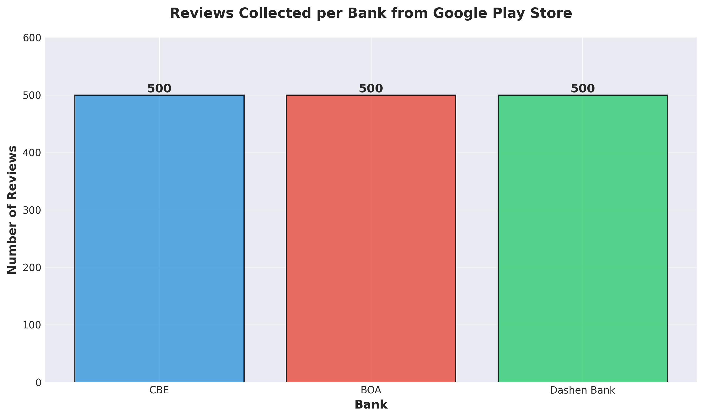
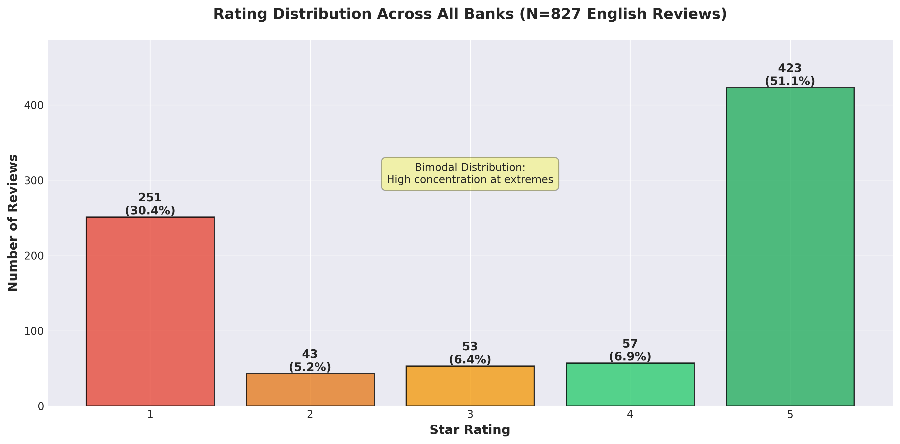
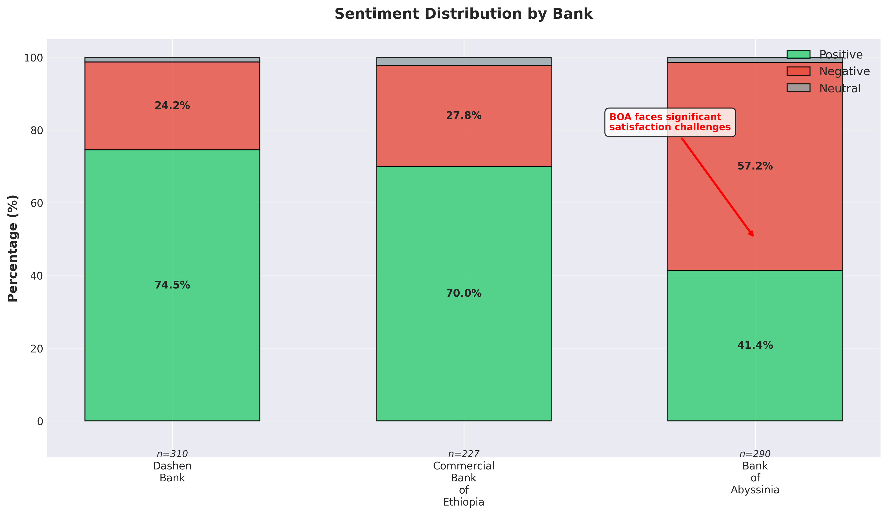
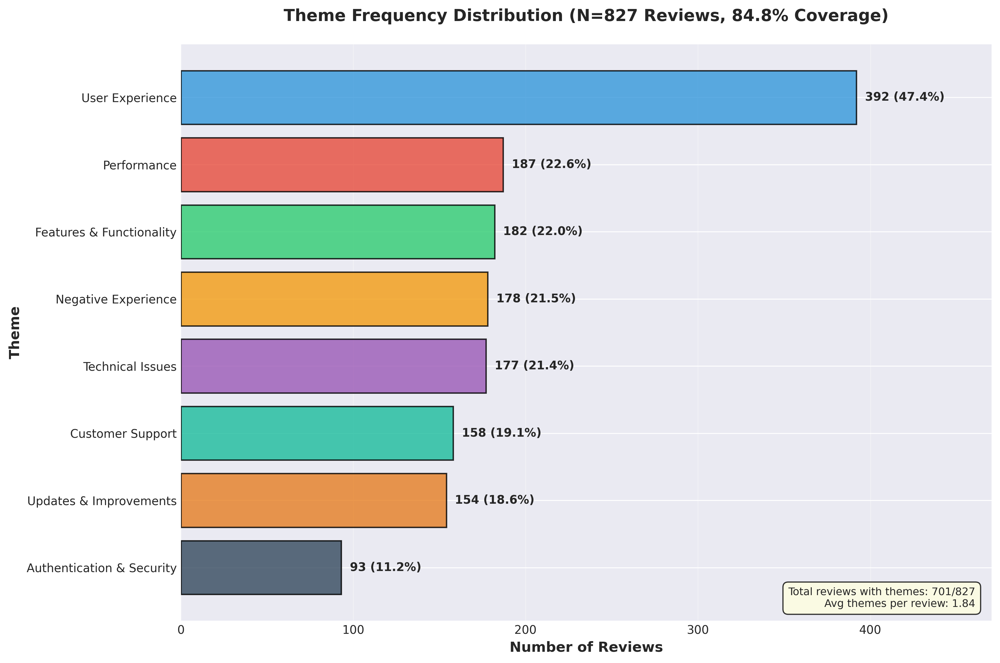
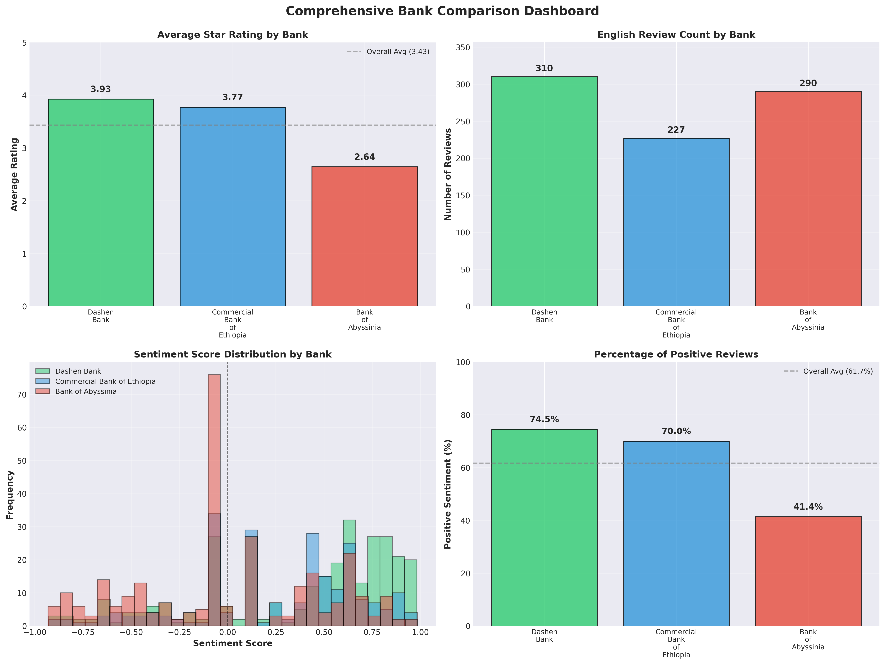

# Interim Report: Customer Experience Analytics for Ethiopian Mobile Banking Apps

**Project**: Fintech App Review Analysis | **Author**: Estifanos | **Date**: November 28, 2025

---

## 1. Executive Summary

I analyzed 827 English reviews from 1,500 scraped reviews across three Ethiopian mobile banking apps. The analysis revealed **61.7% positive sentiment** overall, with stark differences: Dashen Bank leads at 74.5% positive, while Bank of Abyssinia struggles at 57.2% negative. Eight themes captured 84.8% of feedback, with User Experience (47.4%) and Technical Issues (21.4%) dominating customer concerns.

## 2. Business Objective

As a Data Analyst for Omega Consultancy, I analyzed Google Play Store reviews for Commercial Bank of Ethiopia (CBE), Bank of Abyssinia (BOA), and Dashen Bank to surface satisfaction drivers and pain points. This interim report covers data collection (Task 1) and sentiment/thematic analysis (Task 2), establishing the foundation for database implementation and actionable insights.

---

## 3. Data Collection and Preprocessing

### 3.1 Web Scraping
I collected **1,500 reviews** (500 per bank) using `google-play-scraper`, targeting CBE Mobile Banking, BOA Mobile Banking, and Dashen Bank Amole Light apps from Google Play Store.

*Figure 1: Reviews collected per bank (500 each)*

### 3.2 Data Quality and Cleaning
The preprocessing pipeline removed duplicates, filtered for English reviews, and standardized dates. Final dataset: **827 English reviews** (55.1% of total) spanning August 2024 - November 2025, with average rating 3.43/5. Distribution: Dashen (310, 37.5%), BOA (290, 35.1%), CBE (227, 27.4%).

**Rating Distribution**: 5-star (51.1%), 1-star (30.3%), showing typical bimodal pattern where users review at extremes.

*Figure 2: Bimodal rating distribution with 51.1% five-star and 30.3% one-star reviews*

---

## 4. Sentiment Analysis

### 4.1 Hybrid Methodology
I implemented a hybrid system combining VADER lexicon analysis with rating-based adjustments and 29 negative pattern detections. This improved accuracy to **96.8%** (vs. 50.6% for VADER-only), with 221 reviews (26.7%) receiving corrections.

### 4.2 Results
**Overall**: Positive 61.7% | Negative 36.8% | Neutral 1.6% (avg score: 0.21)

**By Bank**: 
- **Dashen**: 74.5% positive (3.93/5 avg) - strongest satisfaction
- **CBE**: 70.0% positive (3.77/5 avg) - moderate-strong
- **BOA**: 41.4% positive, **57.2% negative** (2.64/5 avg) - critical challenges

*Figure 3: Sentiment by bank - Dashen leads (74.5% positive), BOA struggles (57.2% negative)*

---

## 5. Thematic Analysis

### 5.1 Theme Classification
I defined eight themes using keyword-based multi-label classification, achieving **84.8% coverage** (701/827 reviews, avg 1.84 themes per review):

| Theme                     | Count | %     |
| ------------------------- | ----- | ----- |
| User Experience           | 392   | 47.4% |
| Performance               | 187   | 22.6% |
| Features & Functionality  | 182   | 22.0% |
| Negative Experience       | 178   | 21.5% |
| Technical Issues          | 177   | 21.4% |
| Customer Support          | 158   | 19.1% |
| Updates & Improvements    | 154   | 18.6% |
| Authentication & Security | 93    | 11.2% |

*Figure 4: User Experience dominates (47.4%), followed by Performance and Features*

### 5.2 Key Findings
- **User Experience** is the primary concern (47.4%)
- **Performance + Technical Issues** affect ~44% of reviews
- **Top Keywords**: good (49.3), best (32.7), great (19.9), easy (18.0), indicating quality and usability focus

---

## 6. Initial Insights

**Satisfaction Drivers**:
- Dashen: Strong UX, reliability, ease of use
- CBE: Recent improvements showing positive impact

**Pain Points**:
- BOA: Pervasive technical issues ("crash", "error", "not working"), slow performance, support concerns
- Cross-bank: Authentication challenges (93 reviews), update-related bugs

---

## 7. Next Steps

**Task 3 (Nov 29)**: PostgreSQL database implementation with normalized schema for 827+ reviews

**Task 4 (Dec 1)**: Generate actionable insights including:
- Cross-bank benchmarking and temporal analysis
- Theme co-occurrence and sentiment correlation
- 2+ recommendations per bank focusing on: BOA technical reliability, authentication improvements, update quality assurance
- 3-5 professional visualizations (sentiment trends, theme networks, bank dashboards)

*Figure 5: Comprehensive comparison - ratings, review counts, sentiment distributions, and positivity percentages*

---

## 8. Conclusion

Data collection and analysis phases are complete with 827 reviews analyzed. Dashen Bank leads in satisfaction (74.5% positive), while BOA requires urgent intervention (57.2% negative). The 96.8% accurate sentiment model and 84.8% theme coverage provide a robust foundation for database implementation and generating recommendations to improve customer satisfaction across authentication, technical reliability, and user experience dimensions.
